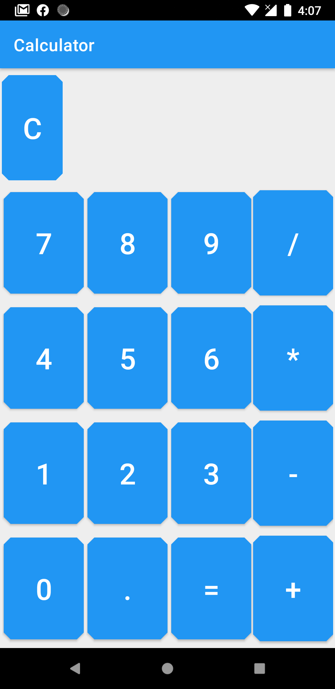

# About this project - CalculatorMVVM
* A sample Android app for demonstrate use of mvvm.
* Application made in kotlin with android architecture component, third party libraries and with MVVM design pattern.
* This application also supports the dark mode which will support in Android 10(API 29)
* Implement material design with shape components which you can see differently in dark mode vs normal mode.

# Features

Some of the features of the app include

* Kotlin - Less code to takes less time to write, read, and less susceptible to bugs. It's also provides features like null safety, extension function, inter operable with java, smart cast, etc.

* MVVM architecture - Using the lifecycle aware viewmodels, the view observes changes in the model.

* Android Architecture Components - Lifecycle awareness has been achieved using a combination of LiveData, ViewModels.

# Demo

# BuildInfo
* Android Studio - 3.6.3
* Compile SDK - 29
* Min SDK - 17
* Target SDK - 29

# Libraries Used
* <a href="https://developer.android.com/jetpack/androidx/">AndroidX Support Libraries</a>
* <a href="https://developer.android.com/topic/libraries/architecture/viewmodel">ViewModel</a>
* <a href="https://developer.android.com/topic/libraries/architecture/livedata">LiveData</a>
* <a href="https://github.com/Kotlin/kotlinx.coroutines">Coroutines</a>
* <a href="https://insert-koin.io/">Koin</a>

# Feedback
* This is a demo development project to showcase my skills and decisions made for development of required tasks. 

